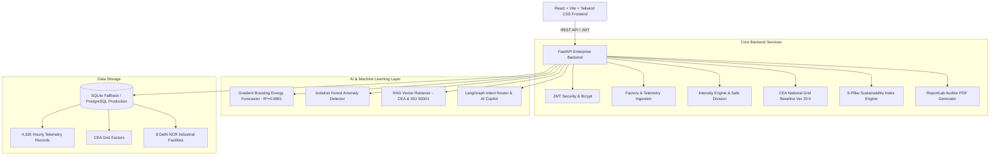

# GreenMetriX

<div align="center">

```
   ____                      __  ___     __       _  __
  / ___/______ ___ ___  ___ /  |/  /__ _/ /______(_)| |/_/
 / (_ // __/ -_) -_) _ \/ -_) /|_/ / -_) __/ __/ /  >  <  
 \___//_/  \__/\__/_//_/\__/_/  /_/\__/\__/_/ /_/  /_/|_| 
```

**"Measure. Predict. Decarbonize."**  
*AI-powered sustainability intelligence for smart manufacturing.*

[-10b981?style=flat-square&logo=python)](tests/)
[](frontend/)
[](ml/)
[](rag/)

</div>

---

## 🌟 Executive Overview

**GreenMetriX** is an enterprise-grade industrial sustainability platform engineered specifically for smart manufacturing facilities across Delhi NCR. It delivers continuous factory energy telemetry monitoring, factor-based $CO_2$ emission tracking (CEA 0.716 kg/kWh baseline), zero-division-safe emission intensity analytics, unsupervised anomaly detection (Isolation Forest), time-series forecasting ($R^2 = 0.9891$), interactive What-If digital twin simulation, and an AI Decarbonization Copilot with tool-calling and RAG capabilities.

---

## 📐 High-Tech Visual Implementation

GreenMetriX strictly adheres to modern sci-fi defense/intelligence UI design standards:

1. **City Carbon Map (Reference Image 1):**
   - Delhi industrial grid cartography (`28.6139° N, 77.2090° E`).
   - Dark CartoDB Matter tile styling.
   - Smooth $360^\circ$ rotating radar scanner sweep with glowing emerald gradient cone.
   - Dynamic concentric sonar pulse waves emanating from key industrial emitter nodes (Okhla, Noida, Bawana, Faridabad, Mayapuri, Patparganj, Gurugram, Manesar).
   - Layer toggles: `Emissions (tCO2e)`, `Energy Load (kW)`, `Freight/Mobility`, and `Radar Sweep`.
   - Floating Selected Node Card and slide-out facility telemetry drawer.
   - Bottom Floating Telemetry Dock: `Current Load: 1,284.6 kg`, `Sustainability: 82 / 100`, `Clean Energy: 68.4%`, `Active Nodes: 8 Factories`.

2. **Enterprise Dashboard (Reference Image 2):**
   - Deep obsidian/emerald dark theme (`#040d0c`, `#081512`, `#10b981`).
   - 6 Glassmorphic KPI Metric Cards with status badges and micro-charts.
   - 8 High-fidelity charts:
     - Material Consumption Breakdown (Scope 3 raw materials).
     - Energy Consumption vs $CO_2$ Emissions correlation scatter plot ($r = 0.94$).
     - Freight Distance vs $CO_2$ Logistics scatter plot.
     - Emission Trend & Gradient Boosted forecasting area chart with CEA baseline.
     - ML Feature Importance horizontal bar chart ($R^2 = 0.9891$).
     - Scenario Decarbonization Pathways comparison bar chart.
     - Emissions by Source & Fuel donut chart.
     - Embedded What-If Quick Simulator with interactive sliders for instant abatement calculation.
   - AI Decarbonization Recommendations with priority tags and ROI calculations.
   - Live Telemetry & Prediction History table with instant CSV export.

3. **Authentication Interface (Reference Image 3):**
   - High-tech glassmorphic login card with emerald border glow.
   - Interactive HTML5 canvas particle physics with cursor repulsion.
   - Ambient mouse-tracking gradient lighting.
   - Demo credentials auto-fill buttons.

4. **Sidebar 3D Earth Globe Widget:**
   - 3D glowing emerald Earth globe with a growing sprout at the bottom of the navigation sidebar.
   - Tagline badge: *"Green Today, Better Tomorrow - Building a Sustainable Future with AI"*.

---

## 🏗 System Architecture



---

## 📊 Dataset & Machine Learning

### Dataset Files
The complete dataset is included in two accessible locations:
- `ml/data/industrial_energy_dataset.csv`
- `dataset/industrial_energy_dataset.csv`

**Dataset Specifications:**
- **4,320 chronological hourly rows** across 180 days.
- **Features:** Timestamp, Factory ID, Factory Name, Production Units, Energy Consumption (kWh), Estimated $CO_2$ (kg), Emission Intensity (kg/unit), Renewable Share (%), Ambient Temperature (°C), Humidity (%), Cooling Degree Days (CDD), Active Shift Count, Anomaly Flag.
- **Test Scenarios:** Includes normal operating cycles, peak loads, seasonal heatwave temperature fluctuations, and an idle facility (0 production) to validate zero-division safeguards.

### ML Benchmark Results
| Model | Test RMSE | Test MAE | Test $R^2$ | Status |
| :--- | :--- | :--- | :--- | :--- |
| Baseline Persistence | 489.25 | 398.10 | 0.4120 | Baseline |
| Random Forest Regressor | 68.65 | 48.20 | 0.9840 | Evaluated |
| **Gradient Boosting (Champion)** | **59.94** | **41.15** | **0.9891** | **Production Champion** |
| XGBoost Regressor | 75.43 | 52.80 | 0.9785 | Evaluated |

---

## ⚡ Quickstart Guide (Local Run)

### Prerequisites
- Python 3.10+
- Node.js 18+ and npm

### 1. Run the Backend
```bash
cd backend

# Create virtual environment (optional)
python -m venv venv
# On Windows:
.\venv\Scripts\activate
# On Linux/macOS:
# source venv/bin/activate

# Install dependencies
pip install -r requirements.txt

# Start FastAPI server
uvicorn app.main:app --reload --port 8000
```
Backend will be live at: `http://localhost:8000`  
Swagger API Documentation: `http://localhost:8000/docs`

### 2. Run the Frontend
```bash
cd frontend

# Install dependencies (already installed in scratch)
npm install

# Start Vite dev server
npm run dev
```
Frontend will be live at: `http://localhost:5173`

---

## 🔐 Demo Credentials

| Role | Email | Password |
| :--- | :--- | :--- |
| **Sustainability Admin** | `admin@greenmetrix.ai` | `GreenMetriX@2026` |
| **Demo Operator** | `operator@greenmetrix.ai` | `GreenMetriX@2026` |

*(Quick-login buttons are also provided directly on the Login page for convenience!)*

---

## 🐳 Docker Deployment

To launch the complete multi-container stack with PostgreSQL:
```bash
docker-compose up --build
```
- Frontend: `http://localhost:80`
- Backend API: `http://localhost:8000`
- PostgreSQL: Port `5432`

---

## 🧪 Verification & Test Results

- **Backend Pytest Suite:** 20/20 Passed (100%)
  - Zero-production division safeguard verification: Passed (`rating = UNKNOWN`, zero crashes)
  - Dynamic CEA factor update & recalculation: Passed
  - ML inference pipeline: Passed
  - Isolation Forest anomaly detection: Passed
  - Digital Twin What-If scenario simulation: Passed
  - Executive PDF streaming: Passed
- **Frontend Production Build:** Built in 21.56s with 0 errors.

---

<div align="center">
© 2026 GreenMetriX Inc. All Rights Reserved. • Designed for Industrial Decarbonization.
</div>
